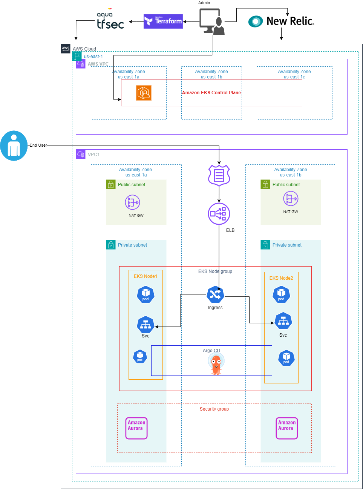

# Designing and Implementing a Resilient and Scalable Platform for Microservice Architecture

## Solution Overview:

It is 3 tier architecture which consists of front end, back end and database layer.

#### 1. Infrastructure Platform Selection:
Compare to Onprem which require investment in hardware and lack of ability to scale easily.
Cloud service AWS offer greater flexibility and wide range of managed services. It offers auto-scaling features that allow to automatically adjust the resources based on demand.

#### 2. Orchestration Technology Selection:
Kubernetes provides container orchestration, automatic scaling, and self-healing capabilities. Managed kubernetes like AWS EKS reduces the complexity to manage control plane components and scale easily with changing load.

#### 3. Infrastructure Automation:
Infrastructure as code (IaC) tool helps to define infrastructure components, networking, and security in code which enables versioning, reproducibility, and easy modifications. Terraform is vendor neutral and support multiple providers.

#### 4. Microservice Deployment Strategy:
Kubernetes by default which support recreate and rollingupdate deployment strategy. Using ArgoCD Rollout feature which supports Blue green and Canary deployment.

#### 5. Infrastructure Testing:
TFSec is a static analysis tool used to scan terraform code to identify and highlight gaps from security aspect from an infrastructure.

#### 6. Configuration Management:
Kubernetes ConfigMaps and secrets which helps to store configuration and secret values.

#### 7. Monitoring Approach:
New Relic is observability platform that provides solutions for Application Performance Monitoring, Infrastructure Monitoring and Log management. 
New Relic Logs which send logs from EKS Cluster to New relic for centralized log managesment.
Alert policies in New Relic used to notify any issues or anamolies in EKS environment.

## Tools and Technologies Used:
Infrastructure:         AWS Cloud, EKS, Cloudwatch, RDS Aurora, EC2, ELB
Source Code Management: Git, GitHub
Continuos Integration:  Jenkins

AWS Cloud, Terraform, Docker, Kubernets, Jenkins, Helm, ArgoCD, New relic, Cloudwatch

--------------------------------------------------------------------------------------------

